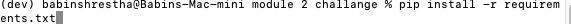

# ** WEEK 2 CHALLANGE ** 

## **Loan Analyzer** :

The application is an part of a loan facilitating software that helps the user to create a list of banks that would be congruent to their home application loan.

 

Based on credit score, income, property valuation, and the amount of debt that the user requests the application will compile a list of banks, along with different respective informations. Moreover, the user can save the list in an externala file so that it can be used for other purposes as well.
 

The application is very interactive as it takes financial informations that banks base their loan information from the user itself to make imporatant valuation. This allows the user to make adjustments. Similarly, the option to save the list would enable the user to export the information to other people like their spouse, family members, realtors, or financial advisors.

---
## The Application

The application filters through the different options of bank loans from different banks based on income, required loan, house price, and credit score of an individual user. Similarly, the application allows the user to generate the list of possible bank loans that the individual could possible appy for based on his financial needs and capabilities.

 

The aim of the application is to ease the already complicated loan application process. Since, the application computes its evaluations based on the core financial information that the banks use, it narrows downs the list to potential loan application; hence, saving time and effort of the user ensuring the best outcomes.

 

---

## Technologies

Describe the technologies required to use your project such as programming languages, libraries, frameworks, and operating systems. Be sure to include the specific versions of any critical dependencies that you have used in the stable version of your project.

The program is based on Python(Version 3.9.10), and was written using VS Code (Version: 1.64.2 (Universal)) for scripting purpose. Execution of the application would require at least installation of Python (latest recomended but anything above version 3.7 would be suffice ).

The application can be run via Command Language Interpreter(CLI): **Terminal or Git Bash**. 

The execution of the program would require installation of different libraries like Fire, Questionary, Pathlib, sys, csv, as well as multiple in built functions. These function libraries cna be  installed on the CLI.

---

## Installation Guide

The User of the application would require to intsall Python on their computer. 

**<U>[To Install Python Click Here](https://www.python.org/downloads/)</U>**

All the libraries required during operation of the application can be installed  in the CLI using a package manager. It can be commanded with with the code below:

**pip install "Library Name"**

For instance, to install fire, use the code below in CLI
> pip install fire

You can install the requirements for application with the command shown below: 

---

## Usage

The applicaion is easy to use as the application is interactive and the next options would be based on the user's input.

 

Option to save 

The option where to save can be directed  at the question **where do you want to save the file?** 

Make sure you save your file as a .csv.

---

## Contributors

edits by: 

[Babin Shrestha](https://www.linkedin.com/in/babin-s-7273b0129/)

Generous support of  Columbia University Bootcamp Program

---

## License

Copyright: CU
